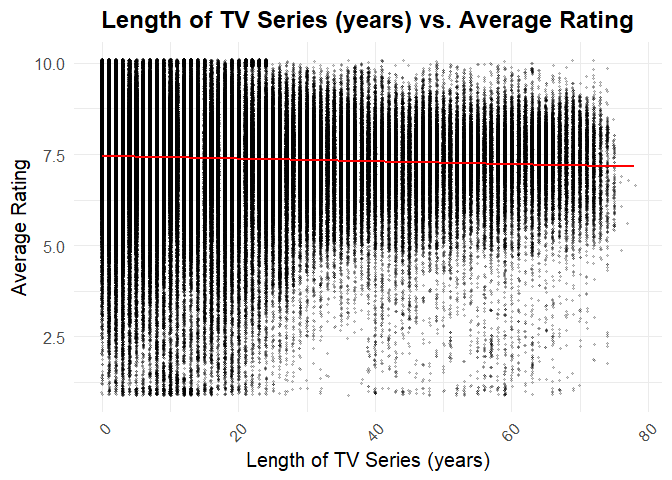

## 1.1 Research Motivation

The television industry has transformed exceptionally in the past decade
with the advent of streaming platforms like Netflix, HBO, Amazon Prime,
and Hulu, among many others. These platforms have reformed how the
audience consumes content, producing series and shows that allure
millions across the world. The global video streaming market is
projected to grow from USD 674.25 billion in 2024 to USD 2,660.88
billion by 2032, exhibiting a CAGR of 18.7% during the forecast
period.(source: fortune business insights) This dramatic growth poses
the question of what factors contribute to the success (in terms of
average customer rating) of these TV shows. One frequently disputed
factor is the length of the TV shows. While some believe longer TV
series allow for complex storytelling and intricate character
development leading to higher customer engagement and satisfaction
(Mercader, 2023), others may argue that excessive length could cause
viewer fatigue and lower customer satisfaction (Mercader, 2023).
Understanding, how the overall length of a TV series influences the
average customer ratings could hold important implications for the
content producers and streaming platforms. This research may help
producers decide the optimal length of the TV series to maximize
customer engagement. Our research aims to indicate the relationship
between the length of the TV series in terms of number of episodes /
number of years the show is running and the average customer ratings. By
establishing this relationship, the question for producers as to whether
more episodes or a new season should be produced, will be made easier.
The producer then has a guideline as to what amount of episodes will
maximize the consumer engagement, and therefore minimize viewer fatigue
which can lead to negative reviews. This led to the formulation of our
research question: How does the length of a TV series influence its
average customers ratings? Additionally,academic researchers in media
and communication studies can use our findings to understand the
dynamics of viewer engagement.Our research could be of interest to
psychologists and sociologists studying media consumption
behavior,providing data on how the length of content affects viewer
engagement, satisfaction, and perceived value.Students can replicate our
study in different contexts (eg: TV series in different languages) to
test the variability of our findings.

## 1.1.2 Analysis plan

The first step in our analysis plan was data exploration. This step
involves computing summary statistics and visualizations, so we can get
an idea about the structure of our dataset. After exploring the data,
the next step was data preparation. In the second step, we have handled
missing observations, transformed variables where necessary, and ensured
that our dataset is ready for analysis. After exploring and preparing
the data, we have performed a regression analysis to quantify the
relationship between TV series length and average customer ratings. We
have added control variables to ensure our model is not biased. A linear
regression is conducted to assess the relationship. After conducting a
linear regression, we have used a t-test to test the alternative
hypothesis: There is a positive/negative relationship between the length
of a TV series and the rating for the series. Finally we have summarized
the key findings.

## 2. Data preparation & analysis

### 2.1.1 Composition of the datasets and description of the variables

### title.episode.tsv.gz

<table>
<colgroup>
<col style="width: 13%" />
<col style="width: 77%" />
<col style="width: 9%" />
</colgroup>
<thead>
<tr class="header">
<th>Variable</th>
<th>Description</th>
<th>Data Class</th>
</tr>
</thead>
<tbody>
<tr class="odd">
<td><code>tconst</code></td>
<td>An alphanumeric identifier unique to each episode.</td>
<td>String</td>
</tr>
<tr class="even">
<td><code>parentTconst</code></td>
<td>An alphanumeric identifier for the parent TV series of the episode.
It links the episode to the overall series.</td>
<td>String</td>
</tr>
<tr class="odd">
<td><code>seasonNumber</code></td>
<td>The season number that the episode belongs to within the TV
series.</td>
<td>Integer</td>
</tr>
<tr class="even">
<td><code>episodeNumber</code></td>
<td>The specific episode number of the <code>tconst</code> in the TV
series.</td>
<td>Integer</td>
</tr>
</tbody>
</table>

### title.basics.tsv.gz

<table>
<thead>
<tr class="header">
<th>Variable</th>
<th>Description</th>
<th>Data Class</th>
</tr>
</thead>
<tbody>
<tr class="odd">
<td><code>startYear</code></td>
<td>The year the series began.</td>
<td>Integer</td>
</tr>
<tr class="even">
<td><code>endYear</code></td>
<td>TV Series end year.</td>
<td>Integer</td>
</tr>
</tbody>
</table>

### title.ratings.tsv.gz

<table>
<colgroup>
<col style="width: 17%" />
<col style="width: 69%" />
<col style="width: 13%" />
</colgroup>
<thead>
<tr class="header">
<th>Variable</th>
<th>Description</th>
<th>Data Class</th>
</tr>
</thead>
<tbody>
<tr class="odd">
<td><code>tconst</code></td>
<td>An alphanumeric unique identifier for each title.</td>
<td>String</td>
</tr>
<tr class="even">
<td><code>averageRating</code></td>
<td>The weighted average of all the individual user ratings.</td>
<td>Numeric</td>
</tr>
</tbody>
</table>

### 2.1.2 Intial data exploration

#### Plotting Relationship Between TV Series Length(total episodes) and Average Ratings

##### Inference : The graph demonstrates a significant spread of ratings across all episode counts, without any clear pattern or trend.Observations with a low number of episodes are densely populated and exhibit a wide range of ratings, spanning nearly the entire rating scale.Observations with a low number of episodes are densely populated and exhibit a wide range of ratings, spanning nearly the entire rating scale. As the number of episodes increases beyond 5,000, the density of observations decreases.

#### Plotting Relationship Between TV Series Length(in years) and Average Ratings

##### Inference : The scatter plot reveals a relatively uniform spread of average ratings across all series lengths, from shorter series (0–10 years) to longer ones (up to 80 years).

## Repository Overview

-   README.md

## Dependencies

#### For R make sure the following packages are installed

    # Install necessary packages
    install.packages("readr")
    install.packages("dplyr")
    install.packages("ggplot2")
    install.packages("rmarkdown")
    install.packages("knitr")

## Authors

**Team 03**

-   Gulsen Yiğit, email: <g.yigit@tilburguniversity.edu>
-   Manju Ganesan Suresh, email:
    <m.p.y.ganesansuresh@tilburguniversity.edu>
-   Silvia Barendse, email: <s.e.barendse@tilburguniversity.edu>
-   Wendy Hu, email: <w.hu@tilburguniversity.edu>
