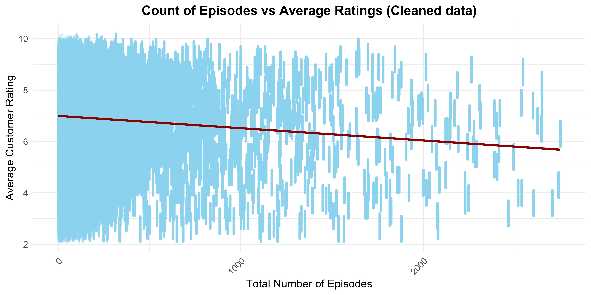
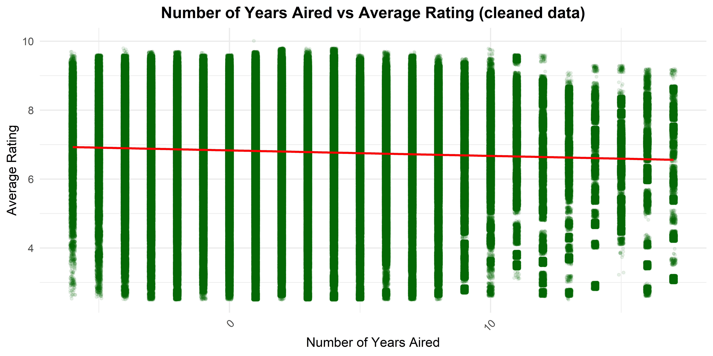

#### Install necessary pacakges for data exploration

The following libraries are required for this analysis: 

- **readr**: For reading data files.

- **tidyverse**: For data manipulation and analysis.

- **dplyr**: For data wrangling and manipulation.

- **ggplot2**: For data visualization.

- **ggcorrplot** : For data visualization.


## 1. Introduction

This report provides the initial data exploration of the data sets. Our goal is to provide the structure of our data set,summarize key variables,and provide some basic exploratory visualizations. The data set contains information about TV series, including customer ratings, number of episodes and series duration.
 
### 1.1. Overview of the Dataset and Variables

The dataset used in the project contains information about TV series and episodes from IMD Since we are interested in understanding the relationship between the length of the TV series and it's average customer ratings, we focus on the three datasets listed and described below.

- **title.episode.tsv.gz**: Contains information about individual episodes of TV series.

- **title.basics.tsv.gz**: Contains information about TV series titles,the start year,genres,etc.

- **title.ratings.tsv.gz**: Contains user ratings for titles.


## 2. Description of Variables


### 2.1. title.episode.tsv.gz


|Variables       |Description                                                                                                    |Class    |
|:---------------|:--------------------------------------------------------------------------------------------------------------|:--------|
|`tconst`        |An alphanumeric identifier unique to each episode.                                                             |String   |
|`parentTconst`  |An alphanumeric identifier for the parent TV series of the episode.It links the episode to the overall series. |String   |
|`seasonNumber`  |The season number that the episode belongs to within the TV series.                                            |Interger |
|`episodeNumber` |The specific episode number of the `tconst` in the TV series.                                                  |Interger |


### 2.2. title.basics.tsv.gz


|Variables   |Description                |Class   |
|:-----------|:--------------------------|:-------|
|`startYear` |The year the series began. |Integer |
|`endYear`   |TV Series end year.        |Integer |


### 2.3. title.ratings.tsv.gz


|Variables       |Description                                      |Class   |
|:---------------|:------------------------------------------------|:-------|
|`tconst`        |Alphanumeric unique identifier of the title.     |String  |
|`averageRating` |Weighted average of all individual user ratings. |Numeric |


## 3. Datasets Description


- **title.basics.tsv.gz**: Contains information about movie and TV series titles, their start year, genres, etc.

- **title.episode.tsv.gz**: Contains information about individual episodes of TV series.

- **title.ratings.tsv.gz**: Contains user ratings for titles.


## 4. Initial Data Exploration: Raw Data

#### title_basics


```
##     tconst           titleType         primaryTitle       originalTitle     
##  Length:11144942    Length:11144942    Length:11144942    Length:11144942   
##  Class :character   Class :character   Class :character   Class :character  
##  Mode  :character   Mode  :character   Mode  :character   Mode  :character  
##                                                                             
##                                                                             
##                                                                             
##                                                                             
##     isAdult            startYear          endYear         runtimeMinutes   
##  Min.   :   0.0000   Min.   :1874      Min.   :   3       Min.   :    0    
##  1st Qu.:   0.0000   1st Qu.:2001      1st Qu.:2000       1st Qu.:   19    
##  Median :   0.0000   Median :2013      Median :2013       Median :   30    
##  Mean   :   0.1455   Mean   :2006      Mean   :2007       Mean   :   43    
##  3rd Qu.:   0.0000   3rd Qu.:2019      3rd Qu.:2019       3rd Qu.:   60    
##  Max.   :2024.0000   Max.   :2031      Max.   :2030       Max.   :59460    
##  NA's   :1           NA's   :1415824   NA's   :11014156   NA's   :7630294  
##     genres         
##  Length:11144942   
##  Class :character  
##  Mode  :character  
##                    
##                    
##                    
## 
```


#### title_episode


```
##     tconst          parentTconst        seasonNumber     episodeNumber    
##  Length:8553624     Length:8553624     Min.   :   1.0    Min.   :    0.0  
##  Class :character   Class :character   1st Qu.:   1.0    1st Qu.:    7.0  
##  Mode  :character   Mode  :character   Median :   1.0    Median :   28.0  
##                                        Mean   :   3.8    Mean   :  425.3  
##                                        3rd Qu.:   3.0    3rd Qu.:  159.0  
##                                        Max.   :2024.0    Max.   :91334.0  
##                                        NA's   :1725429   NA's   :1725429
```

#### title_ratings


```
##     tconst          averageRating       numVotes      
##  Length:1485200     Min.   : 1.000   Min.   :      5  
##  Class :character   1st Qu.: 6.200   1st Qu.:     11  
##  Mode  :character   Median : 7.200   Median :     26  
##                     Mean   : 6.959   Mean   :   1030  
##                     3rd Qu.: 7.900   3rd Qu.:    101  
##                     Max.   :10.000   Max.   :2948962
```


### 4.1. Specific summary statistics of raw data

#### title_episode


| num_rows| num_cols| missing_values_tconst| missing_values_parentTconst| missing_values_seasonNumber| missing_values_episodeNumber|
|--------:|--------:|---------------------:|---------------------------:|---------------------------:|----------------------------:|
|  8553624|        4|                     0|                           0|                     1725429|                      1725429|


#### title_ratings


| num_rows| num_cols| missing_values_tconst| missing_values_averageRating| missing_values_numVotes|
|--------:|--------:|---------------------:|----------------------------:|-----------------------:|
|  1485200|        3|                     0|                            0|                       0|


#### title_basics


| num_rows| num_cols| missing_values_tconst| missing_values_titleType| missing_values_startYear| missing_values_endYear|
|--------:|--------:|---------------------:|------------------------:|------------------------:|----------------------:|
| 11144942|        9|                     0|                        0|                  1415824|               11014156|


## 5. Visualization : raw data

### Plot : 1. Distribution of Ratings for TV Series (raw data)


#### Inference: 

The histogram is slightly skewed towards the right indicating that most of the ratings fall between the range of 5 to 8.The histogram represent all types of `titleType` like shorts,videos,tvEpisodes,tvseries,documentary etc. 


## 6. Data Preparation

### 6.1. Filtering only TV series from titleType

As the Research Question is limited only to TV series other `titleType` are dropped. 


### 6.2. Motivation for dropping missing values (NA)

#### title_basics:

After examining the title_basics dataset, it was noticed that a  significant number of missing values (NAs) occur in the columns `startYear`,`endYear`, `runtimeMinutes`, and `genre`. Since our project requires calculating the series length (series_length = `endYear` - `startYear`), it is crucial to impute rows with missing values in the `startYear` and `endYear` columns. But imputing for `startYear` is inherently misleading, hence imputation is done only for the `endYear`. A group imputation strategy is used to impute values for missing `endYear`.The `startYear` is grouped into bins, each having a 15 year interval.This captures temporal trends while reducing variance. The median value of the `endYear` for each group of `startYear` is used to impute the missing `endYear` values.Since, `startYear` gives information about when the show began, it is assumed that shows starting around the same period are likely to end  around the same time.Additionally, the columns `runtimeMinutes` and `genre` are not necessary for our analysis, so it is dropped.


#### title_episode:

In this dataset, we observe missing values (NAs) in the columns `seasonNumber` and `episodeNumber`.Since this information is specific to each TV series, we do not impute these missing values using data from other TV shows, as doing so would introduce inaccuracies. Additionally, the missing values in these columns are missing at random. Therefore, it is important to drop rows with missing values in these columns.


#### title_ratings:

This dataset does not contain missing values(NA) 


### 6.3. Revised summary statistics : filtered data 

#### title_basics 


```
##     tconst           titleType         primaryTitle       originalTitle     
##  Length:248975      Length:248975      Length:248975      Length:248975     
##  Class :character   Class :character   Class :character   Class :character  
##  Mode  :character   Mode  :character   Mode  :character   Mode  :character  
##                                                                             
##                                                                             
##                                                                             
##                                                                             
##     isAdult          startYear       endYear     runtimeMinutes   
##  Min.   :0.00000   Min.   :1924   Min.   :1925   Min.   :   1.00  
##  1st Qu.:0.00000   1st Qu.:2002   1st Qu.:2005   1st Qu.:  25.00  
##  Median :0.00000   Median :2013   Median :2018   Median :  30.00  
##  Mean   :0.01097   Mean   :2007   Mean   :2009   Mean   :  45.85  
##  3rd Qu.:0.00000   3rd Qu.:2018   3rd Qu.:2018   3rd Qu.:  55.00  
##  Max.   :1.00000   Max.   :2026   Max.   :2030   Max.   :8400.00  
##                                                  NA's   :147488   
##     genres          startYear_group
##  Length:248975      Min.   :1920   
##  Class :character   1st Qu.:1995   
##  Mode  :character   Median :2010   
##                     Mean   :2000   
##                     3rd Qu.:2010   
##                     Max.   :2025   
## 
```


#### title_episode 


```
##     tconst          parentTconst        seasonNumber      episodeNumber    
##  Length:6828195     Length:6828195     Min.   :   1.000   Min.   :    0.0  
##  Class :character   Class :character   1st Qu.:   1.000   1st Qu.:    7.0  
##  Mode  :character   Mode  :character   Median :   1.000   Median :   28.0  
##                                        Mean   :   3.795   Mean   :  425.3  
##                                        3rd Qu.:   3.000   3rd Qu.:  159.0  
##                                        Max.   :2024.000   Max.   :91334.0
```


### 6.4. Merging the datsets

After filtering and cleaning the datasets, we combine them to analyze the relationship between TV series length (number of episodes and total years aired) and customer ratings. We merge title_basics, title_episode, and title_ratings using `tconst` as the key identifier.


### 6.5. Engineering for new variables: 

#### `total_years`

A new variable is created that shows how many years a series has run, called `total_years`. This variable will be one of the independent variable in our analysis, and is created by deducting the first year that the series ran from the last year. 


#### `episode_count`

A new variable is created that shows the total number of episodes a series has, called `episode_count`. This variable will be one of the independent variable in our analysis.


### 6.6. Removing outliers 

Since our dataset is heavily skewed, the Interquartile Range (IQR) method, was used to detect outliers in the variables considered for analysis by calculating the spread of the data.The IQR measures the spread of the middle 50% data, making the data robust for analysis by handling the skewed data.This is the last step in the data preparation process.


## 7. Visualizations

### 7.1. Plots for TV Series Length vs Average Rating

The below plots help understand the relationship between the length of TV series and average customer ratings.Visualizations as part of our initial exploration of the data, which helps us explore trends and patterns in the data.The length of the TV series will be determined based on the number of episodes or the number of years the series was aired.


### Plot 2: Count of Episodes vs. Average Ratings (cleaned data)



#### Key insights :

This scatter plot illustrates the relationship between the `episode_count` and `averageRating`.The regression line slopes downwards, indicating a negative relationship between the total number of episodes and average customer ratings.The plot shows a dense concentration of series with fewer than 1,000 episodes.As the number of episodes increases (above 1,000), there are fewer data points.


### Plot 3: Total years the series was aired vs. Average Rating (cleaned data)





#### Key insights : 
This scatter plot illustrates the relationship between the `total_years` and `averageRating`.The regression line is almost flat, indicating that there is no significant relationship between the two variables.There is a high density of data points from 0 to 10 years, with a wide spread of average ratings.This suggests that number of years aired alone does not impact customer satisfaction, and other factors may be more influential in determining viewer ratings.

### 7.2.  Multicollinearity 

### Plot 4: Correlation Heatmap

We plot the correlation heatmap to understand the correlation between the numeric variables and understand any potential multicollinearity issues.


### Key insights and implications for the regression model:

There is low correlation between `total_years` and `episode_count` (0.25), this led us to run a combined model: `total_years` & `episode_count` as independent variable,while keeping `numVotes` as a control variable and `averageRating` as the dependent variable.


### 7.3. Density plots 

After removing the outliers density plots are plotted to check the distribution of data and identifying whether the variables follow a normal distribution or are skewed and the skewed variables are log transformed for regression. 


### Plot 5: Density plot for total_years


#### Inference : 
The spikes in the density plot of total_years indicate that there are certain natural clusters. eg: series lasting between 1 to 10 years.There is no much skewness or a long tail therefore no log transformation is applied.


### Plot 6: Density plot for episode_count


#### Inference : 

The plot is highly skewed to the right side.There is a long tail, hence `episode_count` is log transformed to stabilize variance in the regression model and improve interpretability of the model.


### Plot 7: Density plot for averageRating


#### Inference : 
Log transformation required since the skewness is moderate on the lower end of the average rating and log transformation is applied.


### Plot 8: Density plot for numVotes


#### Inference : 
The density plot shows that the data is extremely skewed and hence a log transformation of `numVotes` is used in the regression analysis.The log transformation helps reduce the influence  of outliers in the data. 

